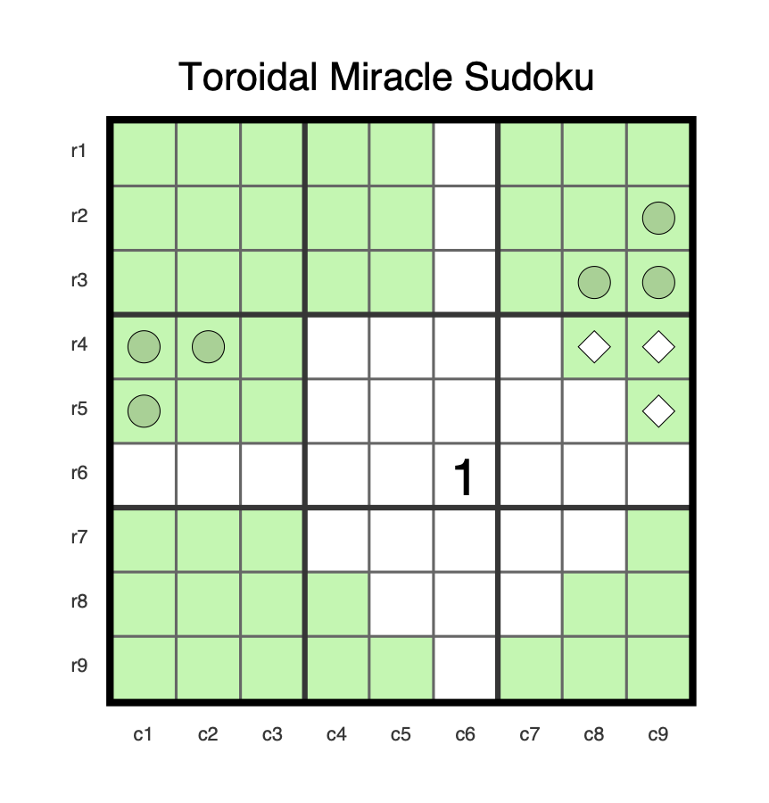

SUDOKU-DIAGRAMS
===============

This library defines a way to declare sudoku diagrams and export them in various formats.

Currently, the library only supports writing to PDF or to a textual description of the diagram.

Throughout this document, we use one main example.
This repository contains [the example as a PDF](./images/sample-output.pdf)

Declaring A Diagram
-------------------

Here is an example of defining a diagram:

    (make-sudoku-diagram :name "Toroidal Miracle Sudoku"
                         :givens '(1 :r6c6)
                         :highlighted '(:b1 :b2c4 :b2c5 :b3
                                        :b4r4 :b4r5 :r4c8 :r4c9 :r5c9
                                        :b7 :r8c4 :r9c4 :r9c5 :r7c9 :r8c8 :r8c9 :b9r9)
                         :marked '("light-diamond" (:r4c8 :r4c9 :r5c9)
                                   "dark-circle" (:r2c9 :r3c8 :r3c9
                                                  :r4c1 :r4c2 :r5c1))
                         :row-labels '("r1" "r2" "r3" "r4" "r5" "r6" "r7" "r8" "r9")
                         :column-labels '("c1" "c2" "c3" "c4" "c5" "c6" "c7" "c8" "c9"))

The currently supported markers are:

* light-diamond
* dark-diamond
* light-circle
* dark-circle

Diagram Alt-Text
----------------

You can retrieve a description of the diagram using the following method:

    (get-alt-text diagram) => string

The output from the above example looks like:

    Toroidal Miracle Sudoku
     - Rows: r1, r2, r3, r4, r5, r6, r7, r8, and r9.
     - Columns: c1, c2, c3, c4, c5, c6, c7, c8, and c9.
     - Given: 1 in row 6 column 6.
     - Highlighted: all of box 1, column 4 in box 2, column 5 in box 2, all of box 3, row 4 in box 4, row 5 in box 4, row 4 column 8, row 4 column 9, row 5 column 9, all of box 7, row 8 column 4, row 9 column 4, row 9 column 5, row 7 column 9, row 8 column 8, row 8 column 9, and row 9 in box 9.
     - Marked with a light-diamond: row 4 column 8, row 4 column 9, and row 5 column 9.
     - Marked with a dark-circle: row 2 column 9, row 3 column 8, row 3 column 9, row 4 column 1, row 4 column 2, and row 5 column 1.

PDF Image
---------

There are two main functions for writing out diagrams to PDFs:

    (sudoku-diagram-as-pdf diagram width height)

    (sudoku-diagram-to-pdf-file filename diagram width height)

The first of these is suitable for invoking in the midst of a `CL-PDF` document.
The latter of these writes a single diagram to a file.
The diagram is made as large as it can be and still fit in the given width and
height constraints.
If there is space left over in either width or height, the diagram will be
centered in that space.

There are some utility functions that are useful in specifying sizes:

    (points x)

    (inches x)

To write out a diagram centered in a 4-inch by 5-inch diagram in the midst of
a `CL-PDF` document, you would do:

    (sudoku-diagram-as-pdf diagram (inches 4) (inches 5))

There are a variety of parameters one can override to customize the diagram.
The `-rgb` values are given as a three-element list `'(r g b)` where each
element is on the range 0.0 to 1.0.

There are a number of parameters available for specifying how text is presented in the diagram:

| Text/Fonts | Default | Description |
|-----------|---------|-------------|
| `*title-font*` | `"Helvetica"` | font to use for rendering the title |
| `*title-font-rgb*` | `'(0.0 0.0 0.0)` | color of the title |
| `*title-font-proportion*` | `0.8` | height of titles relative to cell |
| `*row-column-label-font*` | `"Helvetica"` | font to use for rendering the row/column labels |
| `*row-column-label-font-rgb*` | `'(0.0 0.0 0.0)` | color of the row/column labels |
| `*row-column-label-font-proportion*` | `0.8` | height of row/column labels relative to cell |
| `*digit-font*` | `"Helvetica"` | font to use for rendering given digits |
| `*digit-font-rgb*` | `'(0.0 0.0 0.0)` | color of given digits |
| `*given-digit-font-proportion*` | `0.8` | height of given digits relative to cell |

There are a number of parameters available for specifying how the cells of the grid are rendered:

| Grid Parameter | Default | Description |
|-----------|---------|-------------|
| `*cell-stroke-rgb*` | `'(0.4 0.4 0.4)` | color of cell boundaries |
| `*cell-stroke-width*` | `(points 1)` | width of cell boundaries |
| `*cell-fill-rgb*` | `'(1.0 1.0 1.0)` | background color of cells |
| `*highlight-fill-rgb*` | `'(0.678 0.967 0.690)` | background color of highlighted cells |
| `*box-stroke-rgb*` | `'(0.2 0.2 0.2)` | color of box boundaries |
| `*box-stroke-width*` | `(points 2)` | width of box boundaries |
| `*grid-stroke-rgb*` | `'(0.0 0.0 0.0)` | color of grid boundaries |
| `*grid-stroke-width*` | `(points 4)` | width of grid boundaries |

There are a number of parameters available for specifying how the cells marked with diamonds are rendered:

| Diamond Parameter | Default | Description |
|-----------|---------|-------------|
| `*diamond-stroke-rgb*` | `'(0.0 0.0 0.0)` | color of diamond outline |
| `*diamond-stroke-width*` | `(points 0.5)` | width of diamond outline |
| `*diamond-proportion*` | `0.5` | size of diamond relative to cell |
| `*dark-diamond-fill-rgb*` | `'(0.596 0.820 0.582)` | color of dark diamond |
| `*light-diamond-fill-rgb*` | `'(1.0 1.0 1.0)` | color of light diamond |

There are a number of parameters available for specifying how the cells marked with circles are rendered:

| Circle Parameter | Default | Description |
|-----------|---------|-------------|
| `*circle-stroke-rgb*` | `'(0.0 0.0 0.0)` | color of circle outline |
| `*circle-stroke-width*` | `(points 0.5)` | width of circle outline |
| `*circle-proportion*` | `0.5` | size of circle relative to cell |
| `*dark-circle-fill-rgb*` | `'(0.596 0.820 0.582)` | color of dark circle |
| `*light-circle-fill-rgb*` | `'(1.0 1.0 1.0)` | color of light circle |
